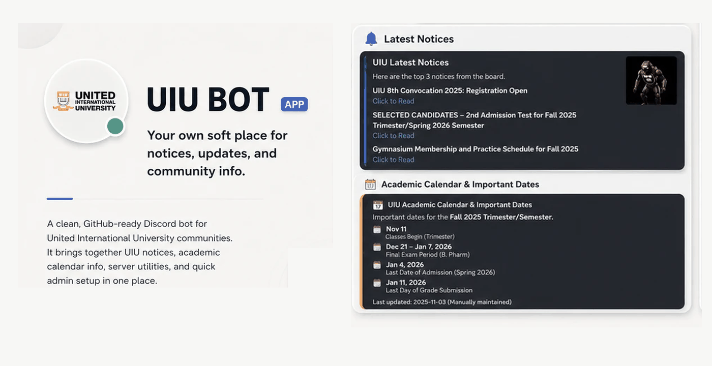

<p align="center">
  
</p>

<p align="center"><sub>Just a cropped gif of the bot working. The dates and text in it are fake examples, not a live feed.</sub></p>

<h1 align="center">UIU Bot</h1>

<p align="center">
  <strong>I got tired of tab-switching, so I made this.</strong><br />
  A Discord bot for UIU students who just want things to be slightly less annoying.
</p>

<p align="center">
  <a href="https://www.python.org/"></a>
  <a href="https://discordpy.readthedocs.io/"></a>
  
</p>

<p align="center">
  <a href="https://discord.com/oauth2/authorize?client_id=1434163768488890549&permissions=8&integration_type=0&scope=bot+applications.commands"></a>
</p>

<br />

## Why it exists

I just wanted to stop leaving Discord to do basic university admin. It’s a small tool that keeps the repetitive stuff inside the server so you don't have to open three different dashboards.

### Figuring out your CGPA

`/cgpa calculator` pops open a private panel. You just add your courses, flag a retake if you're replacing an old grade, pick the credits, and it does the math. It spits out your trimester GPA and what your CGPA will look like. It follows UIU's actual [grading scale](https://www.uiu.ac.bd/academics/grading-performance-evaluation/), but obviously UCAM is the only record that actually matters. Also, nothing you type in that panel gets saved to a database. It just vanishes when you close it.

### Catching notices

You usually miss UIU notices unless you're actively refreshing the site. `/notices` just grabs the latest links from the public board. If you run a server, you can use `/setup` once to pick a channel, and the bot will just quietly drop new notices in there as they happen (oldest first). Use `/stop_notices` if you want it to shut up.

### Summarizing walls of text

If someone hands you a massive document and you just need the short version, `/summary` handles it. It runs a local summarizer by default because I hate sending random text to cloud APIs without asking. If you actually want the heavy AI to do it, you have to explicitly set `use_ai: true` and give it a `GROQ_API_KEY`. It stays off until you force it on.

## The other commands

```text
/calendar       undergrad dates (just a static snapshot I maintain, with a source link)
/poll           basic reaction poll, 2 to 10 choices
/help           private guide on how to use the thing
/ping           checks if it's alive
/about          version info and privacy stuff
```

Just to be super clear: this is independent software. It’s not an official UIU thing, it doesn't log into UCAM, and it will never ask for your student password.

## Running it yourself

You don't have to run any of this. I keep a live copy up, so if you just want the bot in your server, hit the invite button at the top and you're done. The rest of this section is for people who want their own instance.

You need Python 3.12 or newer.

```powershell
git clone https://github.com/mdanikhasan-me/UIU-Discord_Bot.git
cd UIU-Discord_Bot

python -m venv .venv
.venv\Scripts\Activate.ps1
python -m pip install -r requirements.txt
Copy-Item .env.example .env
python main.py
```

Throw your `DISCORD_TOKEN` into the `.env` file. The `GROQ_API_KEY` is completely optional and only matters if you turn on the AI summarizer. Git ignores the real `.env` file anyway.

## Things it doesn't do

- `data/notices_memory.json` is just a local file to remember what notices it already posted. It's ignored by Git.
- Your CGPA inputs and summary texts only exist in memory while you're using them. They don't get written to disk.
- The calendar isn't a live feed from UCAM. It's just a list I update manually.
- It's built to run as a single process using local JSON files. If you want to run a massive multi-server cluster, you'll need to rip out the JSON storage and wire up a real database.

If you change the code, just run the same checks the CI runs so you don't break it:

```powershell
python -m compileall -q main.py commands config services utils tests
python -m unittest discover -s tests -v
```

<p align="center">
  <sub>Built and maintained by <strong>MD Anik Hasan (Sawlper)</strong>.<br />If you want to reach me, <a href="https://mdanikhasan.com">mdanikhasan.com</a> has every way.</sub>
</p>
