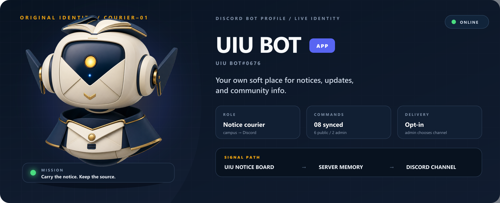
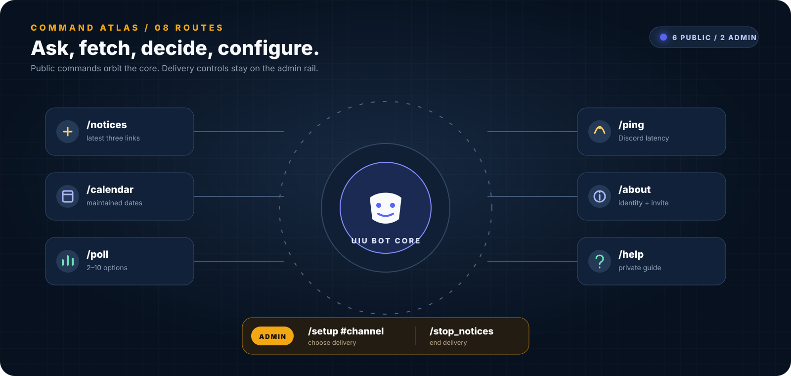

<p align="center">
  
</p>

<p align="center">
  <code>UIU NOTICE BOARD</code>&nbsp;&nbsp;→&nbsp;&nbsp;<code>5 MINUTE WATCH</code>&nbsp;&nbsp;→&nbsp;&nbsp;<code>YOUR DISCORD</code>
</p>

## A notice should not depend on who checked the website this morning.

UIU BOT keeps the university notice board close to the conversation. An admin chooses a Discord channel once; from there, the bot checks for new UIU notices, remembers what that server has already received, and sends only the fresh links.

It is a small bot with a very specific job. That is the point.

<p align="center">
  
</p>

<p align="center">
  <sub>COURIER–01 / an original identity built around the bot’s one job: carrying campus signals.</sub>
</p>

## The notice board, translated for Discord

This is the job as the bot understands it: read the public board, compare links against that server’s memory, then deliver the ones it has not seen.

<p align="center">
  
</p>

The board above is an interface illustration, not a claim that those example notices are live. Every real notification links back to the original UIU page, where the authoritative details belong.

## Eight commands. Two levels of control.

<p align="center">
  
</p>

Public commands answer the everyday questions. The two delivery controls stay with server administrators.

| Command | What comes back |
| --- | --- |
| `/notices` | The latest three items from the UIU notice board. |
| `/calendar` | The dates currently maintained in the project’s academic calendar data. |
| `/poll` | A reaction poll with two to ten options. |
| `/ping` | The bot’s current Discord latency. |
| `/about` | Bot details and its invite link. |
| `/help` | A private command guide inside Discord. |
| `/setup #channel` | **Admin:** selects the destination for automatic notice posts. |
| `/stop_notices` | **Admin:** stops automatic posting for that server. |

## Put it in a server

```powershell
git clone https://github.com/mdanikhasan-me/UIU-Discord_Bot.git
cd UIU-Discord_Bot

python -m venv .venv
.\.venv\Scripts\Activate.ps1
pip install -r requirements.txt
```

Create `.env` in the project root and add the token from your Discord application:

```env
DISCORD_TOKEN=your_bot_token_here
```

Then start the bot:

```powershell
python main.py
```

> `.env` is ignored by Git. Keep the token out of screenshots, issues, and commits.

## What happens after `/setup`

```text
UIU notice page
      │
      ├─ fetch up to 5 current notice links
      │
      ├─ compare each URL with this server's seen list
      │
      ├─ send unseen notices oldest-first
      │
      └─ keep the newest 200 seen URLs
                    │
                    └─ repeat after 5 minutes
```

If UIU’s site cannot be reached, that pass ends quietly and the next scheduled check tries again. A failed request does not intentionally kill the background loop.

## Project map

```text
UIU-Discord_Bot/
├── commands/       Slash commands and the notice loop
├── config/         Bot identity and loop settings
├── data/           Per-server channel and seen-link memory
├── utils/          UIU notice scraper and calendar data
├── Asset/readme/   The visual system used on this page
├── main.py         Startup, extension loading, and command sync
└── requirements.txt
```

Built with Python, `discord.py`, `requests`, `beautifulsoup4`, and `python-dotenv`.

## Full visual reference

<p align="center">
  
</p>

## Before changing the bot

- The academic calendar is static data in `utils/fetch_calendar.py`; update it when UIU publishes a new semester calendar.
- `NOTICE_CHECK_INTERVAL_MINUTES` should stay at five minutes or more to avoid hammering the UIU site.
- The JSON memory is local state. Do not commit real server IDs or channel IDs from a running bot.
- A useful pull request solves one clear problem and explains how it was checked.

That is the whole personality of the project: useful, quiet, and easy to trust.
