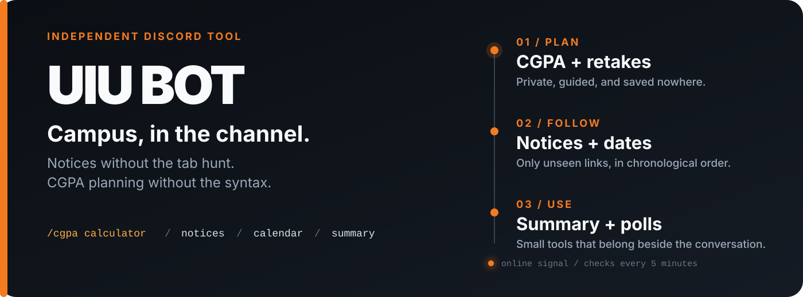

<p align="center">
  
</p>

<h1 align="center">UIU Bot</h1>

<p align="center">
  The notice board, academic planning, and a few genuinely useful tools—inside Discord.
</p>

<p align="center">
  <code>/cgpa calculator</code>&nbsp;&nbsp; <code>/notices</code>&nbsp;&nbsp; <code>/calendar</code>&nbsp;&nbsp; <code>/summary</code>
</p>

The idea is simple: students should not have to hunt through tabs for information their Discord server can surface for them. UIU Bot watches the public notice board, keeps academic dates close, and turns CGPA planning into a guided private interaction instead of a complicated command.

UIU Bot is independent software. It is not an official United International University service, does not sign in to UCAM, and never asks for a student password.

## The calculator

Run `/cgpa calculator`. The bot opens a private panel that behaves like a small form, not a syntax puzzle.

- **Add course** asks for the credit value and expected grade.
- **Add retake** asks for the new grade and the previous grade already counted in your CGPA. If your current standing is missing, the bot collects it first.
- **Set standing** stores completed credits and current CGPA only for that interaction.
- **Calculate CGPA** returns the trimester GPA, trimester credits, and projected cumulative CGPA.

Regular courses and retakes stay visually separate. A retake replaces the earlier quality points without adding the same credits twice. The calculation follows UIU's [published grading scale](https://www.uiu.ac.bd/academics/grading-performance-evaluation/), while UCAM remains the authoritative result for a student's record.

Nothing entered in the calculator is written to disk.

## Campus updates, without the tab hunt

An administrator runs `/setup` once and chooses a notice channel. The bot then checks UIU's public notice board every five minutes and posts only links that server has not seen.

When several notices arrive together, they are posted oldest-first so the channel reads naturally. A notice is marked as delivered only after Discord accepts the message; a failed post is retried on a later check.

`/notices` shows the latest three public notices on demand. `/stop_notices` turns automatic delivery off without erasing the server's history.

## The rest of the toolbox

- `/calendar` — current undergraduate academic dates with a link back to UIU's source.
- `/summary` — a private summary from pasted text or a UTF-8 `.txt`, `.md`, or `.csv` file. It runs locally unless `use_ai` is explicitly enabled.
- `/poll` — a reaction poll with two to ten unique choices.
- `/help` — a short topic picker instead of a wall of commands.
- `/ping` — Discord gateway latency and online status.
- `/about` — version, privacy boundaries, permissions, and the bot invite.

The optional AI summary uses Groq only when the owner configures `GROQ_API_KEY` and the person running the command chooses `use_ai: true`. UIU Bot does not save summary input or output.

## Run your own instance

Python 3.12 or newer is recommended.

```powershell
git clone https://github.com/mdanikhasan-me/UIU-Discord_Bot.git
cd UIU-Discord_Bot

python -m venv .venv
.venv\Scripts\Activate.ps1
python -m pip install -r requirements.txt
Copy-Item .env.example .env
```

Put the Discord token in `.env`, then start the bot:

```powershell
python main.py
```

`.env.example` documents every optional setting. Keep the real `.env` local; it is ignored by Git and should never appear in screenshots, issues, or commits.

## Before you deploy

- Live server and channel state lives in ignored `data/notices_memory.json`.
- The calendar is a maintained snapshot, not a UCAM feed, so its source link should always be treated as final.
- Local JSON storage is intended for one bot process. Multiple instances need shared transactional storage.
- The process must remain online for automatic notices to continue.

Run the same checks used by CI:

```powershell
python -m compileall -q main.py commands config services utils tests
python -m unittest discover -s tests -v
```

The code is split by responsibility: Discord interactions live in `commands/`, calculation and storage rules in `services/`, public UIU fetching in `utils/`, and synthetic coverage in `tests/`.

<p align="center">
  Built for UIU Discord communities. Maintained independently.
</p>
