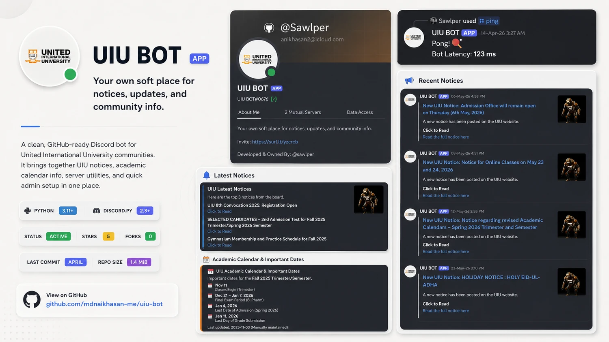

<p align="center">
  <sub>UIU / DISCORD / NOTICE RELAY</sub>
</p>

<h1 align="center">UIU BOT</h1>

<p align="center">
  <strong>The notice board, brought to where students are already talking.</strong>
</p>

<p align="center">
  <sub>A small Discord bot for UIU notices, semester dates, and the handful of server tasks that should not need a spreadsheet.</sub>
</p>

<p align="center">
  
</p>

<p align="center">
  <sub>The bot at a glance: one home for the latest notice, the calendar, and the Discord feed.</sub>
</p>

---

## The quiet loop

UIU BOT does one useful thing well: it keeps an eye on the UIU notice board so a server does not have to. Point `/setup` at a channel and the bot checks the board every five minutes. A link it has already seen stays quiet; a new one arrives as a Discord message with a path back to the original notice.

<p align="center">
  
</p>

| Keep watch | Catch up | Keep the room moving |
| --- | --- | --- |
| Looks at the UIU notice board on a five-minute rhythm. | `/notices` brings the latest three notices into the conversation. | `/poll`, `/ping`, `/about`, and `/help` cover the everyday asks. |
| Remembers notice URLs per server, so configured channels do not get repeats. | `/calendar` shows the maintained academic-calendar dates. | `/setup` and `/stop_notices` leave notice delivery in admin hands. |

## Command desk

<table>
  <tr>
    <th align="left">For everyone</th>
    <th align="left">For server admins</th>
  </tr>
  <tr>
    <td valign="top">
      <code>/notices</code> — latest three UIU notices<br />
      <code>/calendar</code> — important semester dates<br />
      <code>/poll</code> — a poll with up to ten options<br />
      <code>/ping</code> — bot latency<br />
      <code>/about</code> — bot details and invite link<br />
      <code>/help</code> — the in-Discord command guide
    </td>
    <td valign="top">
      <code>/setup #channel</code> — choose where new notices should land<br />
      <code>/stop_notices</code> — turn off automatic posting for this server
    </td>
  </tr>
</table>

## First run

The project is deliberately plain Python. Clone it, give it a token, and start it.

```powershell
git clone https://github.com/Sawlper/UIU-BOT-Discord.git
cd UIU-BOT-Discord

python -m venv .venv
.\.venv\Scripts\Activate.ps1
pip install -r requirements.txt
```

Create a `.env` file in the project root, then add the token from your Discord application:

```env
DISCORD_TOKEN=your_bot_token_here
```

```powershell
python main.py
```

> Keep the token local. `.env` is ignored by Git and should never be pasted into an issue, screenshot, or commit.

## Under the hood

<table>
  <tr>
    <td width="50%" valign="top">
      <strong>Built with</strong><br /><br />
      Python 3.11+<br />
      <code>discord.py</code><br />
      <code>requests</code> + <code>beautifulsoup4</code><br />
      <code>python-dotenv</code>
    </td>
    <td width="50%" valign="top">
      <strong>Two settings worth knowing</strong><br /><br />
      <code>NOTICE_CHECK_INTERVAL_MINUTES</code><br />
      The five-minute notice-check rhythm.<br /><br />
      <code>MAX_SEEN_NOTICES</code><br />
      The per-server memory limit for seen notice URLs.
    </td>
  </tr>
</table>

```text
UIU-BOT-Discord/
├── commands/       Slash-command cogs
├── config/         Bot identity and notice-loop settings
├── data/           Per-server notice memory
├── utils/          UIU notice and calendar fetchers
├── Asset/readme/   README artwork
├── main.py         Bot startup and extension loading
└── requirements.txt
```

## A couple of honest notes

- The calendar is static data, so it needs a refresh when UIU publishes a new semester calendar.
- If the UIU site is unavailable, notice fetching fails gracefully instead of stopping the bot loop.
- Automatic notices are opt-in per server. Nothing is posted until an admin runs `/setup`.

## Make it better

Found a rough edge or have a useful command in mind? Open an issue with the situation it solves, or send a focused pull request. The smaller and clearer the change, the easier it is to keep this bot dependable.
