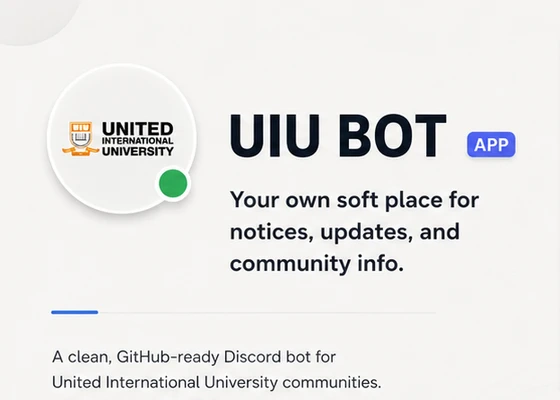

<p align="center">
  
</p>

<h1 align="center">UIU Bot</h1>

<p align="center">
  A small Discord bot for keeping UIU updates, CGPA planning, and useful server tools close to the conversation.
</p>

<p align="center">
  
  
</p>

The bot has one useful bias: keep university information in the place a server already uses. It is independent software—not an official UIU service—and it never asks for UCAM credentials or a student password.

## What people actually use

### `/cgpa calculator`

This opens a private, guided panel. Add a regular course or an **Add retake** entry, choose credits and grades from dropdowns, set your current standing when you want a cumulative projection, and calculate the trimester GPA without writing anything to disk.

Retakes ask for the previous grade that is already counted in the standing. They replace the earlier quality points instead of adding the same credits twice. The math follows UIU's [published grading scale](https://www.uiu.ac.bd/academics/grading-performance-evaluation/); UCAM remains the authoritative record.

### `/notices` and automatic delivery

`/notices` returns the latest three links from UIU's public notice board. An administrator can run `/setup` once to choose a channel; after that, the bot checks every five minutes and posts only links that server has not seen. Several notices arrive oldest-first. `/stop_notices` disables the automatic posts without erasing the server's history.

### `/calendar`, `/summary`, and `/poll`

`/calendar` keeps the current undergraduate dates and links back to UIU's source. `/summary` makes a private brief from pasted text or a UTF-8 `.txt`, `.md`, or `.csv` file; it stays local unless `use_ai` is explicitly enabled. `/poll` creates a reaction poll with two to ten unique choices.

`/help`, `/ping`, and `/about` cover the small moments: a topic-based guide, gateway latency, and the bot's version and privacy boundaries.

## Run it yourself

Python 3.12 or newer is recommended.

```powershell
git clone https://github.com/mdanikhasan-me/UIU-Discord_Bot.git
cd UIU-Discord_Bot

python -m venv .venv
.venv\Scripts\Activate.ps1
python -m pip install -r requirements.txt
Copy-Item .env.example .env
```

Add `DISCORD_TOKEN` to `.env`, then start the process:

```powershell
python main.py
```

`GROQ_API_KEY` is optional. It is used only when the owner configures it and a person explicitly chooses `use_ai: true` for `/summary`. The real `.env` stays local and is ignored by Git.

## A few boundaries worth knowing

- `data/notices_memory.json` is local, ignored runtime state for configured servers and seen notice links.
- Grade entries and summary text exist only for their private interaction.
- The academic calendar is a maintained public snapshot, not a live UCAM feed.
- One bot process is supported with local JSON storage; multiple instances need shared transactional storage.

Run the same checks used by CI before changing the running instance:

```powershell
python -m compileall -q main.py commands config services utils tests
python -m unittest discover -s tests -v
```

The code is split by responsibility: Discord interactions in `commands/`, grading and storage rules in `services/`, public UIU fetching in `utils/`, and synthetic coverage in `tests/`.

<p align="center">
  Built for UIU Discord communities. Maintained independently.
</p>
