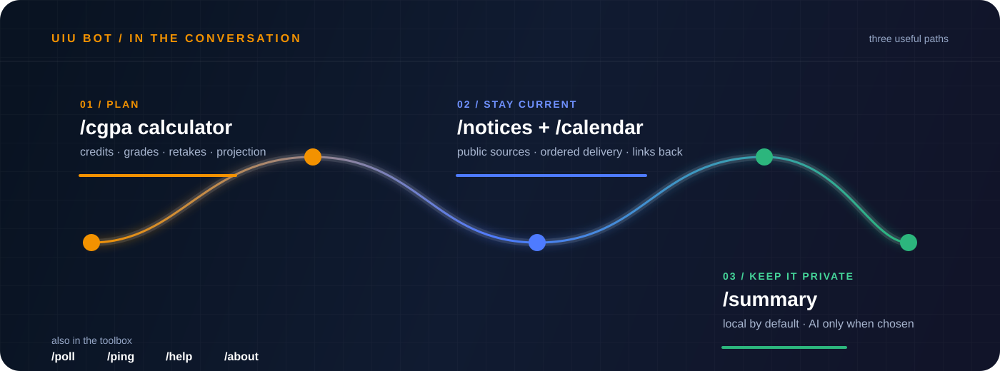
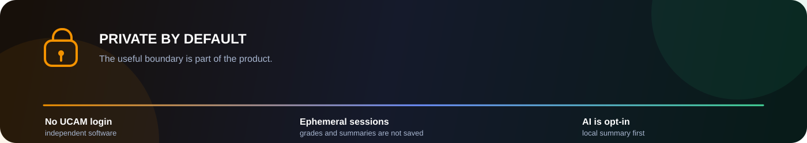

<p align="center">
  
</p>

<p align="center"><sub>The opening reel is a privacy-safe crop of the supplied artwork. The sample notice dates and text are illustrative snapshots, not a live feed.</sub></p>

<h1 align="center">UIU Bot</h1>

<p align="center">
  <strong>University admin, minus the tab-switching.</strong><br />
  A practical Discord companion for UIU communities.
</p>

<p align="center">
  <a href="https://www.python.org/"></a>
  <a href="https://discordpy.readthedocs.io/"></a>
  
</p>

<br />

<p align="center">
  
</p>

<br />

## What belongs in the conversation

UIU Bot is deliberately small in the places that matter. It keeps the repetitive university tasks close to the server instead of making everyone open another dashboard.

### Plan a trimester

`/cgpa calculator` opens a private, guided panel. Add regular courses, add a retake when a previous grade is being replaced, choose credits and grades from dropdowns, then calculate a trimester GPA and projected CGPA. Nothing entered in the panel is written to disk.

The calculation follows UIU's [published grading scale](https://www.uiu.ac.bd/academics/grading-performance-evaluation/). UCAM remains the authoritative academic record.

### Let notices arrive in order

`/notices` shows the latest links from UIU's public notice board. An administrator can use `/setup` once to choose a channel; the background checker then posts only unseen notices, oldest first. `/stop_notices` turns that delivery off without erasing the server's local history.

### Keep private text private

`/summary` turns pasted text or a small UTF-8 text file into a short brief. Local summarization is the default. An AI summary is a deliberate `use_ai: true` choice and requires the owner to configure `GROQ_API_KEY`.

<p align="center">
  
</p>

<br />

## The rest of the toolbox

```text
/calendar       verified undergraduate dates with the source link
/poll           a reaction poll with 2–10 unique choices
/help           a private, topic-based guide
/ping           gateway latency and online status
/about          version, independence, and privacy boundaries
```

The bot is independent software. It is not an official UIU service, does not sign in to UCAM, and never asks for a student password.

## Run your own instance

Python 3.12 or newer is recommended.

```powershell
git clone https://github.com/mdanikhasan-me/UIU-Discord_Bot.git
cd UIU-Discord_Bot

python -m venv .venv
.venv\Scripts\Activate.ps1
python -m pip install -r requirements.txt
Copy-Item .env.example .env
python main.py
```

Put `DISCORD_TOKEN` in `.env`. `GROQ_API_KEY` is optional and is used only when the owner enables the AI path for `/summary`. The real `.env` stays local and is ignored by Git.

## A few honest boundaries

- `data/notices_memory.json` is local, ignored runtime state for configured servers and seen notice links.
- Grade entries and summary text live only for the duration of their private interaction.
- The academic calendar is a maintained public snapshot, not a live UCAM feed.
- One bot process is supported with local JSON storage; multiple instances need shared transactional storage.

Before changing the running instance, run the same checks used by CI:

```powershell
python -m compileall -q main.py commands config services utils tests
python -m unittest discover -s tests -v
```

<p align="center">
  <sub>Built for UIU Discord communities · maintained independently · designed to stay out of the way</sub>
</p>
